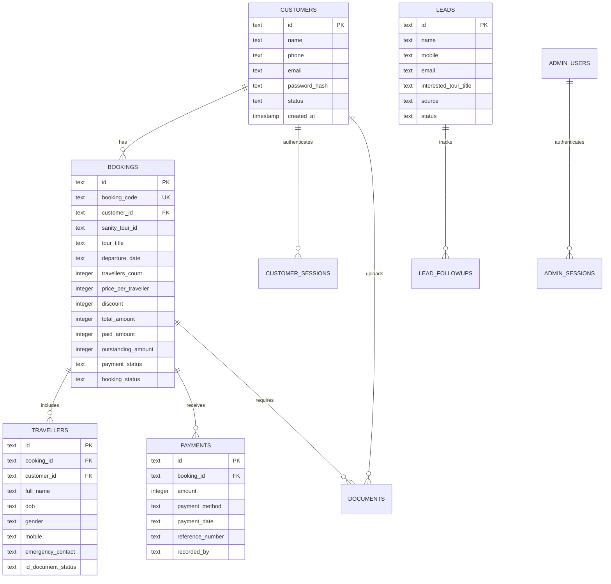

# Travel With Sonali — Complete Master Project Documentation

> **Version:** 1.0.0  
> **Framework:** Next.js 16.3.1 (App Router, Turbopack)  
> **React Version:** 19.2.8  
> **Styling:** Tailwind CSS v4 (@tailwindcss/postcss) with Custom Design Tokens  
> **Database:** Neon Serverless PostgreSQL with Drizzle ORM  
> **Headless CMS:** Sanity.io Studio v6 (`next-sanity`)  
> **Animation Engines:** Motion v13 (Framer Motion), Lenis Smooth Scroll, Custom CSS & SVG Filters  
> **Last Updated:** September 2026  

---

## Table of Contents
1. [Executive Summary & Product Vision](#1-executive-summary--product-vision)
2. [High-Level Architecture & Tech Stack](#2-high-level-architecture--tech-stack)
3. [Design System, Color Palette & Typography](#3-design-system-color-palette--typography)
4. [Complete Directory & File Structure](#4-complete-directory--file-structure)
5. [Frontend Components Breakdown (Every Component)](#5-frontend-components-breakdown)
6. [Interactive UI Library (`components/ui`)](#6-interactive-ui-library)
7. [Animations & Visual Motion Catalog](#7-animations--visual-motion-catalog)
8. [Customer Portal System (`/portal`)](#8-customer-portal-system)
9. [Admin Operations Suite (`/admin`)](#9-admin-operations-suite)
10. [Database Schema & Data Models (Neon + Drizzle)](#10-database-schema--data-models)
11. [Sanity Headless CMS Architecture](#11-sanity-headless-cms-architecture)
12. [API Routes & Server Endpoints](#12-api-routes--server-endpoints)
13. [Utility Scripts & Database Tooling](#13-utility-scripts--database-tooling)
14. [Security, Middleware & Performance](#14-security-middleware--performance)

---

## 1. Executive Summary & Product Vision

**Travel With Sonali** is an editorial, premium group travel and experiential tour platform founded by Sonali Palekar. Unlike mass-market corporate travel agencies that treat travelers like numbers on a manifest, Travel With Sonali provides curated, small-batch (12–16 people), safe, soulful, and female-friendly boutique group tours across the Himalayas, spiritual circuits, Northeast India, coastal escapes, and cross-border expeditions.

### Core Objectives:
- **Editorial Luxury Digital Presence:** High-end visual storytelling featuring smooth inertia scrolling (Lenis), ambient soundscapes, 3D physics-based draggable cards, sticky stacking tour cards, liquid gooey inputs, and SVG turbulence squiggly typography.
- **Two-Way Content Architecture:** Seamless blend of Sanity CMS for marketing content (tours, itineraries, blog stories, Instagram feeds) with instant fallback resilience to static local data.
- **Private Customer Experience Portal (`/portal`):** Dedicated portal for booked travelers to view live booking codes, upcoming trip details, day-by-day itineraries, flight/train meeting points, payment breakdown & receipts, co-traveler management, and KYC identity verification.
- **End-to-End Admin Operations Hub (`/admin`):** Integrated CRM, lead pipeline tracker, tour booking generator, automatic customer de-duplication, payment ledger, traveler KYC reviewer, and audit logger.

---

## 2. High-Level Architecture & Tech Stack

```
+-----------------------------------------------------------------------------------+
|                                  CLIENT LAYER                                     |
|  +---------------------------+  +-----------------------+  +-------------------+  |
|  |   Public Editorial Site   |  |   Customer Portal     |  |   Admin Panel     |  |
|  |   (/, /tours, /stories)   |  |   (/portal/*)         |  |   (/admin/*)      |  |
|  +---------------------------+  +-----------------------+  +-------------------+  |
|         | Lenis Smooth Scroll          | Session Cookie           | Session Cookie|
|         v                              v                          v               |
+-----------------------------------------------------------------------------------+
|                                 NEXT.JS 16 APP ROUTER                             |
|  - Server-Side Rendering (SSR) & Dynamic Route Caching                            |
|  - Next.js Edge Middleware (Route guards for /admin & /portal)                    |
|  - AudioContext Global Audio Singleton (Autoplay fallback, mute/unmute)           |
|  - RESTful Route Handlers (/api/admin/*, /api/portal/*)                           |
+-----------------------------------------------------------------------------------+
       |                                          |
       v                                          v
+-----------------------------+        +--------------------------------------------+
|        SANITY CMS v6        |        |           NEON POSTGRESQL + DRIZZLE        |
|  - Dataset: 'production'    |        |  - Serverless Pooled WebSocket Connection  |
|  - Content Types:           |        |  - Tables: leads, customers, bookings,     |
|    - tour                   |        |            travellers, payments, documents,|
|    - destination            |        |            admin_users, activity_logs      |
|    - story                  |        |  - Relations & Automatic Cascade Deletions |
|    - instagramSection       |        |  - Phone/Email Identity Sync Engine        |
|  - Live GROQ + Static Fallback       |                                            |
+-----------------------------+        +--------------------------------------------+
```

### Core Technologies
| Domain | Technology | Version | Purpose |
|---|---|---|---|
| **Core Framework** | Next.js | 16.3.1 (Turbopack) | React App Router, Server Components, API routes |
| **UI Library** | React / React DOM | 19.2.8 | Concurrent rendering, hooks, component tree |
| **CSS Framework** | Tailwind CSS | v4 (`@tailwindcss/postcss`) | CSS design tokens, utility-first styling |
| **Motion & Physics** | Motion (Framer) | 13.2.0 | Spring physics, drag gestures, 3D rotations |
| **Smooth Scroll** | Lenis | 1.3.26 | Fluid inertia scroll with RAF integration |
| **Headless CMS** | Sanity | 6.9.2 / `next-sanity` 13.3.3 | Rich media, itinerary schemas, vision tool |
| **Database** | Neon Serverless Postgres | `@neondatabase/serverless` 1.1.0 | Cloud-native serverless SQL database |
| **ORM** | Drizzle ORM | 0.45.2 | Type-safe schema definition and query builder |
| **Icons** | Lucide React | 1.31.0 | SVG icons with matching stroke-width |
| **Cryptography** | bcryptjs | 3.0.3 | Password hashing for admin and portal users |

---

## 3. Design System, Color Palette & Typography

The design language embodies an **organic, warm earthy luxury** palette inspired by Himalayan stone, pine forests, terracotta, and soft mountain mist.

### Color Palette (Tailwind Tokens in `globals.css`)
- **Cream / Canvas (`--color-cream`):** `#FDF7F4` — Warm parchment canvas background.
- **Cream Card (`--color-cream-card`):** `#F7EFEA` — Slightly deeper card background for depth and contrast.
- **Sage Green (`--color-sage`):** `#8EB486` — Primary brand accent representing alpine meadows and nature.
- **Sage Hover (`--color-sage-hover`):** `#7A9F73` — Darker tone for hover and active states.
- **Taupe (`--color-taupe`):** `#997C70` — Supporting neutral for subtext, badges, and secondary labels.
- **Espresso (`--color-espresso`):** `#685752` — Primary body copy and dark heading color (replaces harsh `#000000`).
- **Divider (`--color-divider`):** `#E8DCD5` — Hairline borders creating clean architectural grid cells.

### Typography
1. **Sans-Serif (`--font-sans-jakarta`):** *Plus Jakarta Sans* (Google Font)
   - Used for UI elements, labels, buttons, navigation, metadata badges, and high-readability body text.
2. **Serif Display (`--font-serif-playfair`):** *Playfair Display* (Google Font)
   - Used for editorial titles, quotation marks, brand accent headings, and hero titles (`.font-serif-italic`).

---

## 4. Complete Directory & File Structure

```
c:\Projects\clientprojects\travelwithsonali
├── .env.example                       # Template for environment secrets
├── .env.local                         # Local environment credentials (Sanity, Neon DB, Admin auth)
├── package.json                       # Scripts and project dependencies
├── tsconfig.json                      # TypeScript configuration
├── middleware.ts                      # Edge route authentication guards (/admin, /portal)
├── sanity.config.ts                   # Sanity Studio configuration
├── sanity.cli.ts                      # Sanity CLI settings
├── app/
│   ├── layout.tsx                     # Root HTML wrapper, Google Fonts, AudioProvider, SmoothScroll
│   ├── globals.css                    # Tailwind v4 import, theme variables, keyframe animations
│   ├── HomeClientView.tsx             # Public landing page (10 comprehensive sections)
│   ├── page.tsx                       # Landing page server component (Sanity + fallback data loader)
│   ├── components/                    # Global frontend components
│   │   ├── Navbar.tsx                 # Adaptive navigation, soundwave toggle, mobile swipe drawer
│   │   ├── Footer.tsx                 # Editorial curtain-reveal footer
│   │   ├── StackedTourCards.tsx       # Dynamic scroll-scaled deck wrapper
│   │   ├── StackedTourCard.tsx        # Individual sticky deck card
│   │   ├── InstagramRoundCarousel.tsx # Pinned horizontal scroll moments carousel
│   │   ├── AmbientCircles.tsx         # Layered atmospheric blurred light orbs
│   │   ├── AmbientAudioPlayer.tsx     # Audio player hook consumer
│   │   ├── EnquireModal.tsx           # Global lead capture modal
│   │   ├── LightboxModal.tsx          # Fullscreen image viewer
│   │   ├── QRCodeBadge.tsx            # Circular scan badge with rotating text
│   │   └── SmoothScroll.tsx           # Lenis smooth scroll provider
│   ├── context/
│   │   └── AudioContext.tsx           # Singleton HTML5 audio controller with autoplay fallback
│   ├── data/                          # High-fidelity static fallback datasets
│   │   ├── toursData.ts               # Complete tour itineraries, inclusions, highlights
│   │   ├── destinationsData.ts        # Destination profiles and seasons
│   │   ├── storiesData.ts             # Travelogues and articles
│   │   ├── testimonialsData.ts        # Customer reviews
│   │   ├── faqsData.ts                # Categorized FAQs
│   │   └── galleryData.ts             # Curated travel photography
│   ├── tours/                         # Tours catalog & detail pages
│   │   ├── page.tsx & ToursClientView.tsx
│   │   └── [slug]/
│   │       ├── page.tsx & TourDetailClientView.tsx
│   ├── destinations/                  # Destination guides
│   ├── stories/                       # Editorial blog stories
│   ├── gallery/                       # Photo gallery with category filters
│   ├── about/                         # Founder story & mission
│   ├── contact/                       # Contact form & enquiry dispatcher
│   ├── faq/                           # Comprehensive FAQ directory
│   ├── testimonials/                  # Verified reviews
│   ├── portal/                        # Customer Authenticated Portal
│   │   ├── layout.tsx & PortalLayoutClient.tsx
│   │   ├── page.tsx                   # Customer dashboard overview
│   │   ├── login/ & signup/           # Auth views
│   │   ├── forgot-password/ & reset-password/
│   │   ├── trips/                     # Customer booked trips
│   │   ├── travellers/                # Co-traveler details
│   │   ├── payments/                  # Payment logs and outstanding balances
│   │   ├── documents/                 # KYC document uploads
│   │   ├── notifications/             # System alerts
│   │   └── profile/                   # Account settings
│   ├── admin/                         # Admin Operations Suite
│   │   ├── layout.tsx & AdminLayoutClient.tsx
│   │   ├── page.tsx                   # Admin metrics & quick action dashboard
│   │   ├── login/                     # Admin credentials login
│   │   ├── leads/                     # CRM lead board & status pipeline
│   │   ├── customers/                 # Customer directory & booking history
│   │   ├── bookings/                  # Booking creation & management
│   │   ├── travellers/                # Traveler manifest across all tours
│   │   ├── payments/                  # Payment verification & logging
│   │   ├── documents/                 # Document verification queue
│   │   ├── notifications/             # Dispatcher for alerts
│   │   ├── reports/                   # Revenue & booking analytics
│   │   └── settings/                  # System preferences
│   └── api/                           # Backend API handlers
│       ├── admin/                     # Admin endpoints (auth, bookings, leads, payments, etc.)
│       ├── portal/                    # Customer portal endpoints (auth, trips, documents, etc.)
│       └── seed-sanity/               # Data synchronization helper endpoint
├── components/
│   └── ui/                            # Custom UI physics & visual effect components
│       ├── draggable-card.tsx         # Framer Motion 3D tilt & fling card
│       ├── gooey-input.tsx            # SVG liquid gooey search/input field
│       ├── parallax-hero-images.tsx   # Mouse parallax floating images
│       └── squiggly-text.tsx          # SVG animated squiggly displacement text
├── db/
│   ├── index.ts                       # Neon pool & Drizzle ORM client initialization
│   └── schema.ts                      # 12 Drizzle PostgreSQL table schemas & enums
├── lib/
│   ├── utils.ts                       # clsx & tailwind-merge helper (`cn`)
│   ├── admin/auth.ts                  # Admin session verification & cookie helpers
│   ├── portal/auth.ts                 # Customer session verification & hashing helpers
│   └── sanity/
│       ├── client.ts                  # Sanity read/write client
│       ├── image.ts                   # Sanity image URL builder
│       ├── queries.ts                 # GROQ queries with static fallback mapping
│       └── types.ts                   # TypeScript interfaces for Sanity schemas
├── schemaTypes/                       # Sanity Content Studio Schemas
│   ├── index.ts                       # Schema registry
│   ├── tour.ts                        # Tour content model (itinerary, pricing, batches)
│   ├── destination.ts                 # Destination model
│   ├── story.ts                       # Editorial article model
│   └── instagramSection.ts            # Dynamic Instagram carousel schema
└── scripts/                           # Database & Sanity administrative scripts
    ├── initTables.ts                  # Creates all SQL tables on Neon DB
    ├── seedAdmin.ts                   # Generates default super admin user
    ├── seedSanity.ts                  # Migrates static tours into Sanity
    ├── syncSanitySections.ts          # Syncs stories & Instagram moments to Sanity
    ├── mergeDuplicateCustomers.ts     # Customer identity resolution tool
    └── debugCustomerBooking.ts        # Database booking link verification script
```

---

## 5. Frontend Components Breakdown

### 5.1 `Navbar.tsx`
The primary navigation component handles adaptive transparency, scroll detection, ambient sound visualization, user portal routing, and a gesture-driven mobile drawer.

#### Key Engineering Features:
- **Transparent-to-Glass Transition:** Begins 100% transparent on the dark hero section. When scrolled past 20px, it transitions smoothly into a frosted glass container (`bg-[#FFFDF9]/90 backdrop-blur-md border-b border-[#E8DCD5]`).
- **Smart Scroll Direction Hide/Show:** Dynamically hides when scrolling down (`translate-y-full`) and re-appears immediately when scrolling up (`translate-y-0`). Stays pinned within 80px of top.
- **Desktop Ambient Music Control:** Integrated audio toggle in the header rail. Displays the active soundwave indicator when playing (3 animated bouncing bars) or a clean muted icon.
- **2-Line Asymmetric Mobile Toggle:** In place of generic 3-line hamburger icons, uses an editorial 2-line asymmetric icon:
  - Top Line: Full width (`w-5`, 20px).
  - Bottom Line: Shorter width (`w-3`, 12px), aligned right (`items-end`).
  - Hover Effect: The bottom line smoothly expands to full width (`group-hover:w-5`).
  - Colors automatically with `bg-current` adapting to dark hero (white) and light scroll (slate).
- **Fullscreen Mobile Slide Drawer:**
  - Slides in from the right edge with cubic-bezier easing (`translate-x-full` to `translate-x-0`).
  - Includes a dark backdrop with blur (`bg-black/60 backdrop-blur-xs`).
  - Locks document scroll (`document.body.style.overflow = "hidden"`).
  - Numbered menu links (01 Home, 02 Tours, 03 About, 04 Gallery, 05 Contact) with active route highlight.
  - Quick action buttons: `CUSTOMER LOGIN / MY PORTAL` and `EXPLORE TOURS`.
  - **Native Touch Swipe-to-Close:** Tracks `onTouchStart`, `onTouchMove`, and `onTouchEnd`. Swiping right by > 60px smoothly closes the drawer.

---

### 5.2 `HomeClientView.tsx`
The core landing page orchestrator combining 10 rich content sections:

1. **Section 1: Hero Experience**
   - Cinematic background image with multi-stop dark vignette gradient.
   - Headline featuring `SquigglyText` on `"Experience More."`
   - Stadium-shaped oval frame containing Sonali Palekar’s portrait with floating CTA booking button.
   - Social proof strip: `"4.9 / 5.0 Over 2,500+ Happy Travellers"` with stacked traveler avatars.
   - Circular QR Scan Badge (`QRCodeBadge`) directing mobile users to the official Instagram profile.
2. **Section 2: Instagram Moments Carousel (`InstagramRoundCarousel`)**
   - Sticky pinned horizontal scroll track converting vertical page scroll into horizontal translation.
3. **Section 3: Upcoming Tours Deck (`StackedTourCards`)**
   - Dynamic sticky scaling cards where upcoming tours layer over each other as the user scrolls.
4. **Section 4: Brand Pillars Marquee**
   - Endless horizontally translating marquee showcasing the 4 core pillars:
     - *Small Friendly Batches (12–16 max)*
     - *Female-Friendly & 100% Solo Safe*
     - *Curated Stays & Vibe*
     - *Offbeat & Personal*
   - Pauses on hover; framed in frosted glass with edge gradient fades.
5. **Section 5: Draggable Destinations Showcase (`DraggableCardContainer`)**
   - Interactive canvas where travelers can fling, drag, and toss 7 destination polaroids with 3D momentum and velocity decay.
6. **Section 6: Traveller Testimonials**
   - 3-column card grid with star ratings, quotes, traveler avatars, and destination tags.
7. **Section 7: 4-Step Process ("How It Works")**
   - Editorial numerals (`01` to `04` in large Playfair Display font) describing the booking-to-travel journey.
8. **Section 8: Editorial Journal ("Stories From The Road")**
   - 2-column story cards featuring cover images, category badges, publication dates, and read times.
9. **Section 9: Meet Your Host ("Meet Sonali")**
   - Personal narrative section with high-res portrait, founder philosophy, and link to full `/about` page.
10. **Section 10: FAQ Accordion**
    - Smoothly expanding accordion answering top pre-booking concerns.
11. **Footer & Global Enquire Modal Trigger:** Seamless transition into the footer reveal.

---

### 5.3 `StackedTourCards.tsx` & `StackedTourCard.tsx`
A proprietary deck-stacking interaction that simulates luxury physical itinerary cards:

- **Progressive Sticky Tops:**
  - Desktop: `calc(76px + ${index * 14}px)`
  - Mobile: `calc(60px + ${index * 6}px)`
- **Dynamic Scroll Math:** Reads `getBoundingClientRect()` of all sibling cards on scroll via `requestAnimationFrame`.
  - As subsequent cards move up over earlier cards, the earlier cards progressively scale down (`scale -= progress * scaleStep`), dim their brightness (`brightness -= progress * 0.03`), and fade slightly.
- **Mobile Responsive Optimization:**
  - Card height reduced to ~380px on mobile to prevent overflow.
  - Image banner compact at 175px (`h-44`).
  - Price display and CTA buttons ("Enquire" and "Explore Tour") placed side-by-side to guarantee zero clipping on mobile screens.

---

### 5.4 `InstagramRoundCarousel.tsx`
A pinned horizontal scroll experience connected to Sanity CMS:

- **Section Height:** Pinned over `220vh`–`260vh` of scroll distance.
- **Scroll Hijacking Mechanism:** The outer section is tall, while the inner viewport is `sticky top-0 h-screen`. As the user scrolls vertically through the section, `updateScroll` computes the normalized progress (0 to 1) and translates the inner track horizontally:
  $$\text{translateX} = \text{progress} \times -\text{maxTranslate}$$
- **Content:** Pulls moments from Sanity (`instagramSection` document) with instant fallback to 7 curated mountain, beach, and campfire moments.

---

### 5.5 `AmbientCircles.tsx`
Generates fluid, floating organic ambient light orbs behind sections to create warmth and depth:
- Implemented with SVG and CSS `blur(60px)` to `blur(100px)`.
- Features 5 unique layout variants (`variant="1"` through `"5"`).
- Uses subtle infinite CSS floating animations (`animate-float-slow`, `animate-float-reverse`, `animate-pulse-subtle`).
- Pointer events disabled (`pointer-events-none`) so interaction with buttons and text remains unaffected.

---

### 5.6 `Footer.tsx`
- **Architectural Grid:** Multi-column layout divided by `#E8DCD5` lines.
- **Content Blocks:**
  - Column 1: Brand manifesto, logo, social media links (Instagram, YouTube, WhatsApp).
  - Column 2: Quick navigation links with hover arrows.
  - Column 3: Top destinations index.
  - Column 4: Contact details (email, phone, address) and direct WhatsApp booking link.
- **Bottom Strip:** Copyright, privacy policy link, terms and conditions link, and cancellation policy link.

---

### 5.7 `EnquireModal.tsx`
Global inquiry modal accessible from anywhere on the website:
- Automatically pre-populates the interested tour name when triggered from specific tour cards.
- Collects: Full Name, Phone Number, Email, Number of Travelers, Preferred Dates, and Custom Notes.
- Submits directly to `/api/admin/leads` to create a new lead in the CRM pipeline.

---

### 5.8 `AudioContext.tsx`
Global audio singleton managing the ambient mountain soundscape (`/audio/birdsaudio.mp3`):
- Loop enabled, volume set to a relaxing 35% (`0.35`).
- **Autoplay Handling:** Automatically handles strict browser autoplay restrictions. If the browser blocks initial autoplay, it attaches one-time listeners (`click`, `keydown`, `touchstart`) to immediately start playback on first user gesture.
- Persists user preferences (paused vs. playing) in `localStorage` under key `tws_audio_paused`.

---

### 5.9 `SmoothScroll.tsx`
Integrates **Lenis** smooth scrolling:
- Configures duration (1.2s), easing function (`Math.min(1, 1.001 - Math.pow(2, -10 * t))`), and direction (`vertical`).
- Runs in a continuous `requestAnimationFrame` loop, producing inertia-based smooth scrolling across all browsers.

---

## 6. Interactive UI Library (`components/ui`)

### 6.1 `draggable-card.tsx`
- **Physics Engine:** Powered by Motion (`useMotionValue`, `useVelocity`, `useSpring`, `useTransform`).
- **3D Tilt on Drag:** Converts cursor displacement into responsive 3D rotational tilt:
  - `rotateX` dynamically maps `mouseY` [-300, 300] to [25deg, -25deg].
  - `rotateY` dynamically maps `mouseX` [-300, 300] to [-25deg, 25deg].
- **Dynamic Glare Effect:** Simulates a glossy finish by varying radial gradient opacity as the card tilts.
- **Velocity Toss & Decay:** Releasing a dragged card applies spring physics and decays velocity within viewport constraints.

### 6.2 `squiggly-text.tsx`
- Generates an animated wobbling effect using inline SVG displacement filter techniques.
- Injects a hidden `<svg>` filter containing `<feTurbulence>` and `<feDisplacementMap>`.
- Cycles through 5 generated random seed frames at 70ms–80ms intervals, giving text an alive, hand-drawn vibrational effect.

### 6.3 `parallax-hero-images.tsx`
- Mouse-tracking parallax container that moves floating images across varying depth layers.
- Uses spring-damped motion (`damping: 25, stiffness: 120`) to prevent jitter.
- Supports two depth variants: `default` and `edge-focus`.

### 6.4 `gooey-input.tsx`
- Liquid morphing input field using SVG `<feGaussianBlur>` and `<feColorMatrix>` matrix filters:
  $$\text{values} = \text{"1 0 0 0 0  0 1 0 0 0  0 0 1 0 0  0 0 0 20 -10"}$$
- Creates an organic droplet effect when buttons or search icons detach and morph into the input field.

---

## 7. Animations & Visual Motion Catalog

| Animation | File Location | Technology | Trigger / Duration | Visual Outcome |
|---|---|---|---|---|
| **Inertia Smooth Scroll** | `SmoothScroll.tsx` | Lenis RAF | Global window scroll | Fluid, cinematic inertial scroll movement |
| **Stacked Card Scaling** | `StackedTourCards.tsx` | Vanilla RAF / CSS Transforms | Window scroll over deck | Earlier cards scale down (0.95x, 0.90x), dim brightness and stack |
| **Pinned Horizontal Scroll** | `InstagramRoundCarousel.tsx` | CSS `translate3d` via RAF | Scroll through 240vh section | Pinned viewport translates moments horizontally with momentum |
| **2-Line Menu Icon Hover** | `Navbar.tsx` | Tailwind CSS transitions | Mouse hover on menu button | Shorter line smoothly expands from 12px to 20px |
| **Drawer Slide & Swipe** | `Navbar.tsx` | CSS Transforms + Touch events | Click / Touch swipe right > 60px | Mobile menu slides from right edge; touch swipe dismisses |
| **Soundwave Visualizer** | `Navbar.tsx` | CSS Keyframes (`bounce`) | Audio playback active | 3 vertical sage-colored bars oscillate at staggered frequencies |
| **Hand-Drawn Wobble** | `squiggly-text.tsx` | SVG `feTurbulence` / Motion | Loop (70ms per frame) | Playful vibration on key headings ("Experience More", "Where Next") |
| **3D Polaroid Toss** | `draggable-card.tsx` | Motion Spring Physics | User mouse / touch drag | Real-time 3D tilt, glare reflections, and velocity-based toss |
| **Core Pillars Marquee** | `HomeClientView.tsx` | CSS Keyframes (`marquee-left`) | Infinite linear (36s) | Smooth infinite horizontal strip; pauses on hover |
| **Floating Ambient Light** | `globals.css` / `AmbientCircles` | CSS Keyframes (`float-slow`) | Infinite alternate (22s–26s) | Floating, breathing color gradients behind cards |
| **Curtain Reveal** | `Footer.tsx` | CSS Stacking Context | Scroll to bottom of page | Content reveals footer gracefully |

---

## 8. Customer Portal System (`/portal`)

The Customer Portal provides travelers with self-service tools for their booked trips.

```
/portal/login -------------> /portal (Dashboard)
      |                            |
      v                            +---> /portal/trips (Upcoming & Past Bookings)
/portal/signup                     |        |
      |                            |        +---> Detailed Itinerary & Hotel Info
      v                            +---> /portal/travellers (Co-traveler KYC)
/portal/forgot-password            +---> /portal/documents (Upload Aadhaar/Passport)
      |                            +---> /portal/payments (Receipts & Outstanding)
      v                            +---> /portal/notifications (Trip updates)
/portal/reset-password             +---> /portal/profile (Contact info & security)
```

### 8.1 Authentication & Security
- **Endpoints:** `/api/portal/auth/login`, `/signup`, `/logout`, `/forgot-password`, `/reset-password`.
- **Session Cookie:** `customer_session` (HTTP-only, Secure in production, SameSite=Lax).
- **Phone-Based Identity Linking:** During signup, the system checks if an existing customer profile exists with that phone number (e.g., created by admin during offline booking). If matched, it claims the profile by attaching the password hash, immediately exposing all previously booked trips!

### 8.2 Portal Sub-Modules
1. **Dashboard Overview (`/portal`):**
   - Active countdown timer to the next departure.
   - Quick action cards for uploading missing documents or paying outstanding dues.
   - Direct WhatsApp emergency support button.
2. **My Trips (`/portal/trips`):**
   - Lists all confirmed, completed, and pending bookings.
   - Cards display tour title, departure date, group size, payment status, and unique booking code (e.g. `TWS-2026-840`).
   - Expands into day-by-day itineraries, flight meeting instructions, and gear packing lists.
3. **Travellers Management (`/portal/travellers`):**
   - Manage details for self and co-travelers (full name, date of birth, gender, emergency contact).
4. **Document Vault (`/portal/documents`):**
   - Secure upload portal for identity proof (Aadhaar, Passport, Voter ID) required for permit zones (e.g. Spiti Valley, Sikkim).
5. **Payment History & Receipts (`/portal/payments`):**
   - Total trip cost, discount applied, advance paid, and remaining balance.
   - Downloadable payment confirmation details.

---

## 9. Admin Operations Suite (`/admin`)

The Admin Suite enables operations, accounts, and tour managers to run trips efficiently.

### 9.1 Layout & Navigation (`AdminLayoutClient.tsx`)
- **Collapsible Icon-Rail:** Features a toggle button beside the logo. Clicking collapses the sidebar from `w-64` to `w-20` (icon-only mode), maximizing screen space for large data tables. Clicking the top logo expands it back.
- **Mobile Responsive Drawer:** On mobile screens, slides out as a drawer overlay.

### 9.2 Key Modules
1. **Command Dashboard (`/admin`):**
   - Real-time revenue metrics, total active bookings, pending leads count, and traveler numbers.
   - Recent activity stream.
2. **Lead CRM Pipeline (`/admin/leads`):**
   - Ingests website inquiries submitted through `EnquireModal` or contact forms.
   - Status pipeline: *New → Contacted → Interested → Follow-up → Booking Pending → Converted → Lost*.
   - Lead notes and followup logging.
3. **Booking Dispatcher (`/admin/bookings`):**
   - Create new bookings by selecting tours and departure batches directly from Sanity CMS.
   - Auto-finds existing customers or registers new ones.
   - Computes financials: travelers count × price per traveler − discount = total amount.
   - Records initial advance payment and generates a booking code (`TWS-YYYY-XXX`).
4. **Customer Directory (`/admin/customers`):**
   - Searchable customer records with lifetime trip counts, total spend, and notes.
5. **Payment Ledger (`/admin/payments`):**
   - Log payments via UPI, Cash, Bank Transfer, or Card with reference/UTR numbers.
   - Automatically recalculates booking balance (*Unpaid*, *Partially Paid*, *Paid*).
6. **Document Verification Queue (`/admin/documents`):**
   - Review uploaded traveler IDs, verify permits, or request re-uploads with admin notes.

---

## 10. Database Schema & Data Models (Neon + Drizzle)

Configured in [`db/schema.ts`](file:///c:/Projects/clientprojects/travelwithsonali/db/schema.ts) using Drizzle ORM against a Neon Serverless PostgreSQL instance.



### Table Inventory
1. `admin_users`: Super admins, operations, accounts, and staff credentials.
2. `admin_sessions`: Admin session tokens with expiration timestamps.
3. `leads`: CRM inquiries from the website, Instagram, WhatsApp, or referrals.
4. `lead_followups`: Chronological followup notes per lead.
5. `customers`: Primary customer accounts with unique phone numbers and credentials.
6. `customer_sessions`: Customer portal login tokens.
7. `customer_password_resets`: Secure 6-digit verification codes for forgotten passwords.
8. `bookings`: Confirmed trips, financial terms, and departure schedules.
9. `travellers`: Individual passenger manifest linked to bookings.
10. `payments`: Payment transactions and reconciliation ledger.
11. `documents`: KYC proofs (Aadhaar, Passport) with verification statuses.
12. `notifications`: Real-time system notifications for travelers and admins.
13. `activity_logs`: Audit trail tracking operations actions.

---

## 11. Sanity Headless CMS Architecture

Sanity serves as the headless content engine for all marketing content, allowing Sonali and her team to update tours and blog posts without touching code.

### Schemas (`schemaTypes/`):
- **`tour.ts`:**
  - Title, slug, hero image, multi-image gallery.
  - Duration (e.g. `"6 Days / 5 Nights"`), starting & ending locations.
  - Group size limits, transport types, accommodation standards, meals included.
  - Price and promotional price labels.
  - Day-by-day detailed itinerary array with daily title, description, meals, and overnight stay.
  - Inclusions and exclusions lists.
- **`destination.ts`:**
  - Name, slug, state/region, cover photo, description, best season to visit.
- **`story.ts`:**
  - Travelogue title, slug, cover image, category, publication date, read time, Rich PortableText body.
- **`instagramSection.ts`:**
  - Carousel header, Instagram handle, profile URL, CTA button text, array of moments (title, subtitle, image, tag, post URL).

### Fallback Resilience Pattern
Implemented in `lib/sanity/queries.ts`. If Sanity API credentials are not provided or the network is unreachable, all queries seamlessly fall back to comprehensive static datasets in `app/data/`, ensuring the website **never breaks or displays blank cards**.

---

## 12. API Routes & Server Endpoints

### Admin APIs (`/api/admin/`)
- `POST /api/admin/auth/login`: Validates admin credentials and sets session cookie.
- `POST /api/admin/auth/logout`: Clears admin session.
- `GET /api/admin/auth/me`: Retrieves currently authenticated admin profile.
- `GET /api/admin/bookings`: Lists all bookings with customer and payment relations.
- `POST /api/admin/bookings`: Creates a new booking, resolves customer identity by phone, calculates totals, and creates initial passenger records.
- `GET /api/admin/bookings/[id]`: Fetches a single booking with payment logs and traveler manifest.
- `PATCH /api/admin/bookings/[id]`: Updates booking status, travel dates, or notes.
- `DELETE /api/admin/bookings/[id]`: Cascading deletion of a booking.
- `GET /api/admin/customers`: Returns customer list with booking counts and spend totals.
- `GET /api/admin/leads`: Returns CRM lead list with status and date filters.
- `POST /api/admin/leads`: Ingests inquiries from public forms.
- `PATCH /api/admin/leads/[id]`: Updates lead status and appends followup notes.
- `POST /api/admin/payments`: Logs a payment, updates paid/outstanding balances on the booking.
- `PATCH /api/admin/documents/[id]`: Updates document verification status (*Verified*, *Rejected*).

### Portal APIs (`/api/portal/`)
- `POST /api/portal/auth/login`: Customer authentication via phone/email and password.
- `POST /api/portal/auth/signup`: Registers a customer; auto-links existing bookings by phone.
- `POST /api/portal/auth/logout`: Clears customer session.
- `POST /api/portal/auth/forgot-password`: Generates reset token and code.
- `POST /api/portal/auth/reset-password`: Validates code and updates password hash.
- `GET /api/portal/dashboard`: Retrieves traveler's upcoming trips, alerts, and summary.
- `GET /api/portal/trips`: Returns all bookings linked to the logged-in customer ID.
- `GET /api/portal/notifications`: Returns unread notifications for the traveler.
- `POST /api/portal/notifications`: Marks notifications as read.
- `POST /api/portal/documents`: Handles identity document uploads.

---

## 13. Utility Scripts & Database Tooling

Located in the [`scripts/`](file:///c:/Projects/clientprojects/travelwithsonali/scripts) directory, executable via `npx tsx scripts/<script_name>.ts`:

1. `initTables.ts`: Idempotent SQL script initializing all PostgreSQL tables, indices, and enums on Neon DB.
2. `seedAdmin.ts`: Creates the primary `SUPER_ADMIN` user with secure bcrypt hashing.
3. `seedSanity.ts`: Takes static tours from `toursData.ts` and uploads them to the Sanity `production` dataset.
4. `syncSanitySections.ts`: Synchronizes the 4 demo stories and the 7 Instagram carousel moments to Sanity.
5. `mergeDuplicateCustomers.ts`: Detects duplicate customer accounts sharing the same phone number, merges their booking histories, and removes orphaned customer rows.
6. `debugCustomerBooking.ts`: Validates booking linkages between customer records and booking codes in the database.

---

## 14. Security, Middleware & Performance

### 14.1 Route Middleware (`middleware.ts`)
- Edge middleware guards all routes matching `/admin/:path*` and `/portal/:path*`.
- Unauthenticated requests to protected areas are redirected to their respective login pages (`/admin/login`, `/portal/login`) with the return URL preserved in the `?from=` query parameter.
- Logged-in users attempting to access auth pages (e.g. `/admin/login` or `/portal/login`) are automatically forwarded to their active dashboards.

### 14.2 Performance Optimizations
- **Turbopack Compilation:** Next.js 16.3.1 configured for ultra-fast HMR and bundle compilation.
- **Image Optimization:** Next.js `<Image>` component with responsive sizes, `priority` on hero banners, and WebP format delivery.
- **RAF Scroll Throttling:** All scroll-dependent animations (Navbar, StackedTourCards, InstagramRoundCarousel) use `requestAnimationFrame` ticking to avoid layout thrashing and maintain 60 FPS.
- **Database Connection Pooling:** Uses Neon Serverless pooled connections to prevent connection exhaustion in serverless environments.

---

*Documentation compiled and verified for Travel With Sonali codebase.*
